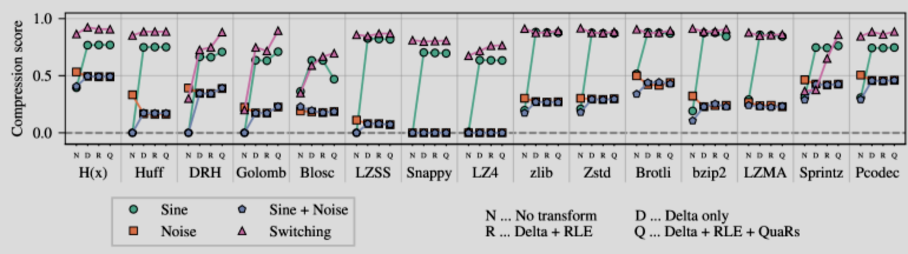

# TYP Proejct idea #

Experimental project

title: **How different compression methods impact graph traversal efficiency differently on the CPU hardware leve**

## Compressed Sparse Row Graph (CSR) ##

Currently thinking only focus on **unweighted directed graph**
<br/>
That for each node, only storing the **outgoing edges**

`node_array` is a strictly equal or increasing integer array.<br/>
Where `node_array[ node_x ]` return the starting position of `node_x`'s edges.<br/>
Integer values can be duplicated.

`edge_array` is a array of integer array.<br/>
Integer values cannot be duplicated within subarray.<br/>
Sort the sub-array to enable binary-search and improve compression ratio.

Use `uint64_t` for `node_array`
<br/>
Use `uint32_t` for `edge_array`

Assuming $|V| \le {2 ^ {32} - 1}$
<br/>
Assuming $|E| \ge {2 ^ {32} - 1}$

```c
// Uncompressed 
typedef struct csr_graph{
	uint64_t*	node_array;
	size_t		node_size;
	uint32_t*	edge_array;
	size_t		edge_size;
}

// Compressed edge_array
typedef struct comp_edge_graph{
	uint64_t*	node_array;
	size_t		node_size;
	uint8_t*	edge_comp_array;
	size_t		edge_byte_size;
}

// Compressed node_array
typedef struct comp_node_graph{
	uint8_t*	node_comp_array;
	size_t		node_byte_size;
	uint32_t*	edge_array;
	size_t		edge_size;
}

// Compressed both node_array and edge_array
typedef struct comp_graph{
	uint8_t*	node_comp_array;
	size_t		node_byte_size;
	uint8_t*	edge_comp_array;
	size_t		edge_byte_size;
}
```

## Compression Schemes  ##

On purposely chose the new recent Integer Encoders.
<br/>
Hugely influenced by these 2 compression survey paper:
* [Inverted Index Compression, 2018 Paper](https://arxiv.org/pdf/1908.10598)
* [Lossless Compression of Time Series Data, 2025 Paper](https://arxiv.org/abs/2510.07015)


**Compression Methods**:
* intermediate transformation
	* Delta Coding
		* Key for sorted data
	* QuaRs
		* "smaller-numbers-less-bits" principle
		* reshapes arbitrary distributions into unimodal ones centered around zero
		* [2025, Paper](https://arxiv.org/abs/2501.12929v1)
	* Blocking
		* Partition of array into block of array
		* Enable indexing (for `node_array`)
	* Run-length encoding
		* Cancelled because the property of CSR graph<br/>
		There are fewer consecutive identical values in the `node_array`<br/>
		And no consecutive identical values in `sub edge_array`
* encoder
	* Sprintz
<br/>
(`uint32, uint64`, IoT Time Series data,  forecasting encoding + delta coding + run-length encoding + bit-packing), [2018 Paper](https://arxiv.org/abs/1808.02515)
	* partitioned Elias-Fano
<br/>
(`uint32, uint64`, Integer data, partition + Elias-Fano), [2014 Paper](https://dl.acm.org/doi/10.1145/2600428.2609615)
	* opt_vbyte
<br/>
(`uint32`, Integer data, partition + SIMD + Variable-Byte), [2020 Paper](https://ieeexplore.ieee.org/document/8691421)
	* Pcodec
<br/>
(`uint32, uint64`, Integer Float data, Statistical + Binning), [2025 Paper](https://arxiv.org/abs/2502.06112)
* optional encoder
	* bzip2		(General, Dictionary)
	* Brotli	(General, Dictionary)
	* LZ4		(General, Dictionary)
	* Stream VByte<br/>
	(Integer data, SIMD + Variable-Byte), [2018 Paper](https://arxiv.org/abs/1709.08990)
	* ...

## Graph Dataset ##

My Current CPU Spec (`lscpu`):
* Name: 13th Gen Intel(R) Core(TM) i9-13900HX (X86-64)
* // All information based on performance core, say core 8
* Cache-L1_Data: 48 KiB (private to one P-core)
* Cache-L2: 2 MiB (private to one P-core)
* Cache-L3: 36 MiB (shared globally)
* RAM: 15.3 GiB
* max MHz: 5400
* min MHz: 800
* vector ISA: avx2 (256bit), ssse3, sse4_1, sse4_2, fma, avx_vnni
* scalar-bit ISA: popcnt, bmi1, bmi2, abm
* scalar-memory ISA: erms, fsrm, movdir64b, clflushopt, clwb

Total memory footprint in bytes 
$\approx {(|V| \times 8) + (|E| \times 4)}$
<br/>
`sizeof(uint64_t)` == 8, `sizeof(uint32_t)` == 4

Chose dataset size > L2 size on purposely.
<br/>
If all in cache, the uncompressed version likely to be faster
<br/>
But this could also be a point
<br/>
"where small graph is faster without compression"

**Dataset**:

* Small: [Amazon product co-purchasing network, June 01 2003](https://snap.stanford.edu/data/amazon0601.html)
	* (|V|(403394) * 8 + |E|(3387388) * 4) = 16776704 = 16 MiB

* Medium: [Pokec social network](https://snap.stanford.edu/data/soc-Pokec.html)
	* (|V|(1632803) * 8 + |E|(30622564) * 4) = 135552680 = 129 MiB

* Large: [uk-2002](https://law.di.unimi.it/webdata/uk-2002/)
	* (|V|(18,520,486) * 8 + |E|(298,113,762) * 4) = 1340618936 = 1.2 GiB

* Ex-Large: [Twitter follower network](https://snap.stanford.edu/data/twitter-2010.html)
	* (|V|(41652230) * 8 + |E|(1468364884) * 4) = 6206677376 = 5.7 GiB

## Experiment ##

## Stage 1 ##

Understand the baseline compression behaviour for different compression methods.

**Experiment Setup**:
<br/>
Given a sorted increasing `node_array` from one of the dataset.
<br/>
Using `node_array` from dataset capture graph property.
<br/>
Perform 2 tasks:
1. Encode the given `node_array` into a `comp_array`
2. Decode the given `comp_array` and accumulate a sum from the array<br/>Depending on the method, prefer to decode and accumulate on fly

<br/>

Measure the following figure:
1. Encoding array
	* Compression ratio
	* // Optional
	* Execution time
	* Throughput
2. Accumulating from decoded array
	* Execution time
	* Throughput
	* Number of instructions
	* Number of cycles
	* Instructions Per Cycle (IPC) //computed
	* Number of cache load and miss rate (L1 and L3, L2 optional)
	* Number of branch and miss rate

<br/>

**Compression Schemes**:
1. Data Transformation:
* Original integer
* QuaRs
* Delta Coding
* Delta Coding + QuaRs

2. Encoder:
* No compression
* Sprintz
* partitioned Elias-Fano
* opt_vbyte
* Pcodec

Total number of environment = 4 * 5  = 20

**Data Visualisation**:
1. Encoding array
* 20 environment * 1 (Compression ratio) figure table
<br/>
Each entry contain a raw value and (+/- percentage)
<br/>
Percentage normalised based on (Original raw integer + No compression)

* 2D graph
	* x = environment (Data Transformation + Encoder)
	* y = Compression ratio
	* x will first ordered by Encoder, then Data Transformation
	<br/>
	Like this:
      * Original integer = O, QuaRs = Q, Delta = D
	  * No compression = NC, Sprintz = SPZ...
	  * x = [NC O, NC Q, NC D, NC D + Q, SPZ O, SPZ Q, SPZ D, SPZ D + Q, ...]
	* Draw a line within same Encoder,
	<br/>
	This emphasize the difference of Data Transformation with Encoder.

Inspire by


2. Accumulating from decoded array
* 20 environment * 7 figure table
<br/>
Each entry contain a raw value and (+/- percentage)
<br/>
Percentage normalised based on (Original raw integer + No compression)
3. Combined result
* 2D graph
	* x = Compression ratio
	* y = Normalised decoding throughput
	* point = environment (Data Transformation + Encoder)